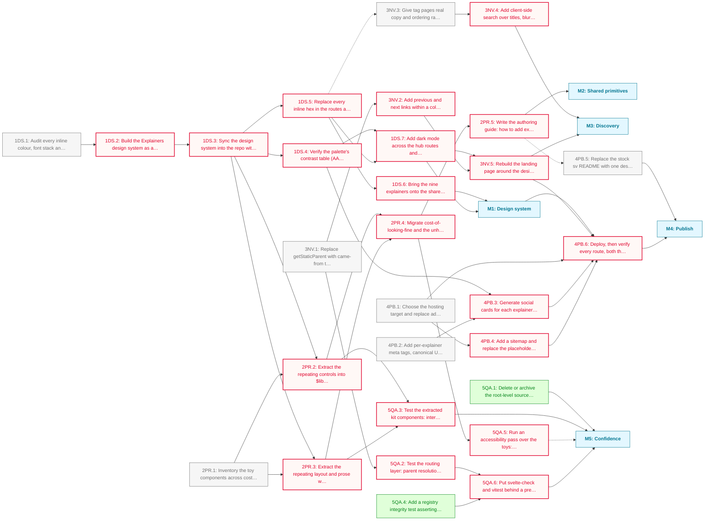

# Explainers PHASE_1 Roadmap

Nine explainers are ported and working: the registry resolves them, collections and tags group them, per-explainer navigation gets a reader between them. What none of that has yet is an identity, a public address or anything stopping a change to one shared component from quietly breaking the other eight.

Phase 1 closes those gaps in that order. A design system built in Claude Design comes first because almost everything visual waits on it. Shared primitives come out of the toys next, so adding explainer ten is a matter of composition rather than another 200KB of bespoke markup. Discovery and publishing turn the set into something a stranger can arrive at, and the confidence milestone makes the whole thing safe to keep changing.

**Critical path:** `1DS.1 → 1DS.2 → 1DS.3 → 1DS.5 → 1DS.7 → 3NV.5 → 4PB.6`; the design system gates the visual work, the visual work gates the landing page and the landing page gates the deploy. Everything else hangs off that spine or runs beside it.

---

## Milestone 1: Design system

**Goal:** One visual identity, built in Claude Design and synced into the repo, so no component carries a hardcoded colour.

- [ ] **1DS.1**: Audit every inline colour, font stack and spacing value across the routes, shared components and the nine explainers; record what the palette actually has to cover
  - Note: The toys carry their own palette.ts; unhurried carries unhurried.css. The audit decides which values are identity and which are per-explainer character worth keeping.
- [ ] **1DS.2**: Build the Explainers design system as a Claude Design project: colour tokens, type scale, spacing and the core component specs _(blocked: depends on 1DS.1)_
  - Note: Claude Design (claude.ai/design) is the authoring surface, per the phase decision. Semantic aliases only: `--ink`, `--surface`, `--accent`, `--danger`.
- [ ] **1DS.3**: Sync the design system into the repo with `/design-sync` and wire its tokens into a project theme under `.claude/themes/` _(blocked: depends on 1DS.2)_
  - Note: Incremental component-at-a-time sync, never a wholesale replace. The theme's html target emits the light and dark custom properties.
- [ ] **1DS.4**: Verify the palette's contrast table (AA 4.5:1 body, 3:1 large) in both light and dark, and record it alongside the theme _(blocked: depends on 1DS.3)_
- [ ] **1DS.5**: Replace every inline hex in the routes and shared components with semantic aliases _(blocked: depends on 1DS.3)_
  - Note: `+page.svelte`, the collection, tag and explainer routes, `+layout.svelte` and `ExplainerNav` are the known offenders.
- [ ] **1DS.6**: Bring the nine explainers onto the shared tokens, keeping each one's deliberate character where it earns its place _(blocked: depends on 1DS.5)_
  - Note: Depends on 1DS.1's call about which per-explainer values are identity rather than drift.
- [ ] **1DS.7**: Add dark mode across the hub routes and the explainer chrome _(blocked: depends on 1DS.4, 1DS.5)_

---

## Milestone 2: Shared primitives

**Goal:** The interaction vocabulary the toys already share, extracted once, so explainer ten costs a fraction of explainer nine.

- [ ] **2PR.1**: Inventory the toy components across cost-of-looking-fine, unhurried and the standalone explainers; mark what genuinely repeats
  - Note: Slider, Button, Control, Readout, Gauge, Toy, Section, Prose and Aside all look like candidates. Repetition has to be shown before anything is extracted.
- [ ] **2PR.2**: Extract the repeating controls into `$lib/components/explainer-kit`, typed and themed _(blocked: depends on 2PR.1, 1DS.3)_
- [ ] **2PR.3**: Extract the repeating layout and prose wrappers into the same kit _(blocked: depends on 2PR.1, 1DS.3)_
  - Note: `formats/` (the tokeniser and `CodeSpecimen`, shared by two explainers) moves into the kit here, beside the unhurried layer. It is shared-layer material that sits under `components/explainers` only because there was nowhere else to put it.
- [ ] **2PR.4**: Migrate cost-of-looking-fine and the unhurried layer onto the kit, deleting the per-explainer duplicates _(blocked: depends on 2PR.2, 2PR.3)_
- [ ] **2PR.5**: Write the authoring guide: how to add explainer ten, from data entry through registry to the kit's components _(blocked: depends on 2PR.4)_
  - Note: The pipeline deliverable. Written after the migration, from what it actually taught.

---

## Milestone 3: Discovery

**Goal:** A reader can find the next thing worth reading, and the way back reflects where they came from.

- [ ] **3NV.1**: Replace `getStaticParent` with came-from tracking so the back-link names the hub the reader actually arrived from
  - Note: The standing TODO in `explainers.ts`. Membership is non-exclusive, so static resolution picks the wrong parent whenever a reader arrives by tag.
- [ ] **3NV.2**: Add previous and next links within a collection, and a related-explainers block driven by shared tags _(blocked: depends on 3NV.1)_
- [ ] **3NV.3**: Give tag pages real copy and ordering rather than a bare filtered list
- [ ] **3NV.4**: Add client-side search over titles, blurbs and tags _(blocked: depends on 3NV.3)_
- [ ] **3NV.5**: Rebuild the landing page around the design system, so the hub reads as the front of a publication _(blocked: depends on 1DS.7, 3NV.2)_

---

## Milestone 4: Publish

**Goal:** The nine explainers live at a real URL, and a stranger arriving from a shared link sees something deliberate.

- [ ] **4PB.1**: Choose the hosting target and replace `adapter-auto` with the specific adapter
  - Note: Vercel and GitHub Pages are both in the toolchain already. Static output would suit a set of prerenderable essays.
- [ ] **4PB.2**: Add per-explainer meta tags, canonical URLs and Open Graph data driven by `ExplainerMeta`
  - Note: The blurb and title already exist in the data; nothing reaches the document head yet.
- [ ] **4PB.3**: Generate social cards for each explainer from the design system _(blocked: depends on 4PB.2, 1DS.4)_
- [ ] **4PB.4**: Add a sitemap and replace the placeholder `robots.txt` _(blocked: depends on 4PB.1)_
- [ ] **4PB.5**: Replace the stock `sv` README with one describing what this project actually is
- [ ] **4PB.6**: Deploy, then verify every route, both themes and a cold share link on a real device _(blocked: depends on M1, 4PB.1, 4PB.3, 4PB.4, 3NV.5)_

---

## Milestone 5: Confidence

**Goal:** Changing a shared component no longer risks nine explainers silently, and nothing ships that the repo cannot explain.

- [x] **5QA.1**: Delete or archive the root-level source files now every explainer lives in `src`
  - Note: `what-nobody-meant.tsx`, `unhurried-edition.jsx`, `4-englishes.html` and `what-everyone-said.html`. Git history holds them either way. Also add `.DS_Store` to `.gitignore`.
- [ ] **5QA.2**: Test the routing layer: parent resolution, tag filtering and collection membership _(blocked: depends on 3NV.1)_
  - Note: `explainers.test.ts` is the only test so far, and Vitest with testing-library is already wired.
- [ ] **5QA.3**: Test the extracted kit components: interaction, keyboard access and readout correctness _(blocked: depends on 2PR.2, 2PR.3)_
- [x] **5QA.4**: Add a registry integrity test asserting every `ExplainerMeta` id resolves to a component and back
  - Note: Cheap guard against the failure mode of adding an explainer to one list and not the other.
- [ ] **5QA.5**: Run an accessibility pass over the toys: keyboard operation, focus order, reduced motion and screen-reader labelling _(blocked: depends on 2PR.4)_
  - Note: A soft milestone member: it stays visible in M5 without gating anything downstream.
- [ ] **5QA.6**: Put `svelte-check` and `vitest` behind a pre-push check so the deployed build cannot regress quietly _(blocked: depends on 5QA.2, 5QA.4)_

---

## Dependency Diagram

